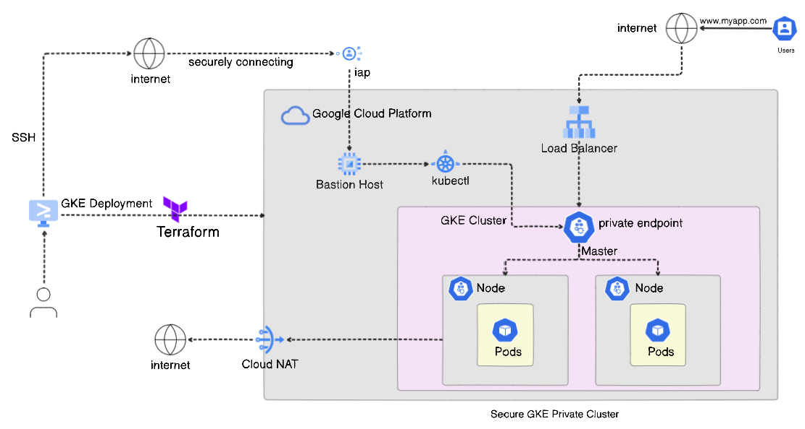

# Iac with Terraform and Kubernetes
In the advancing landscape of cloud computing and DevOps, managing infrastructure efficiently is crucial for maintaining scalable and reliable applications. This project centers on using Terraform, an infrastructure-as-code tool, to provision and manage Kubernetes clusters on cloud platforms Google Cloud Platform. 

The integration of Terraform with Kubernetes is key to deploying and managing applications effectively. This project will provide experience in using Terraform to set up and manage Kubernetes infrastructure, including deploying applications and utilizing Google’s controllers to optimize resource management.

# Google Kubernetes Engine (GKE) Module
This repository contains a [Terraform](https://www.terraform.io/) module for running a Kubernetes cluster on [Google Cloud Platform (GCP)](https://cloud.google.com/?hl=en) using [Google Kubernetes Engine (GKE)](https://cloud.google.com/kubernetes-engine?hl=en) 

GKE is a Google-managed implementation of the Kubernetes open-source container orchestration platform. Kubernetes was developed by Google, drawing on years of experience operating production workloads at scale on Borg, the in-house cluster management system.

It is an ideal platform that configures the infrastructure that runs on containerized apps, such as networking, scaling, hardware, and security. GKE provides the operational power of Kubernetes while managing many of the underlying components, such as the control plane and nodes depending on the mode of operation - Standard mode or Autopilot mode. 

A private GKE cluster is a Kubernetes cluster whose nodes don’t have external IP addresses, which means that clients on the internet cannot connect to the IP addresses of the nodes. This is important for providing an extra layer of security and privacy, as well as a means of controlled access. There are some IP allocation rules for both the control plane and worker nodes of private clusters in GCP. See [Private cluster rules](https://cloud.google.com/kubernetes-engine/docs/how-to/private-clusters) 

[comment]: <ADD REFERENCES TO APPLICATION. IT IS FROM DOCKER GETTING STARTED>
